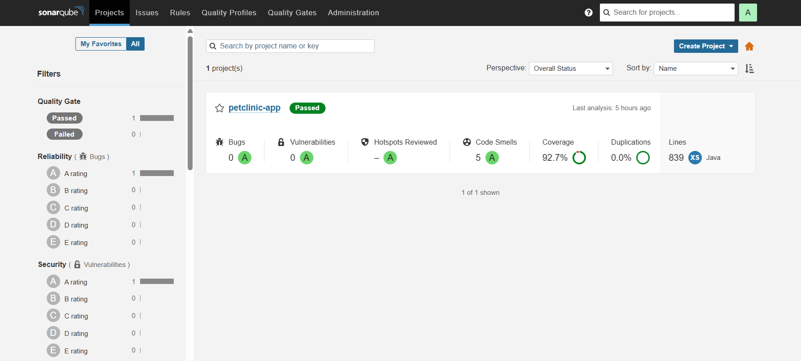
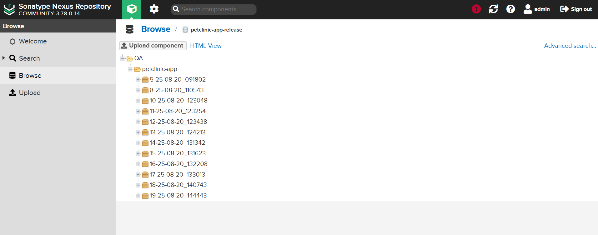
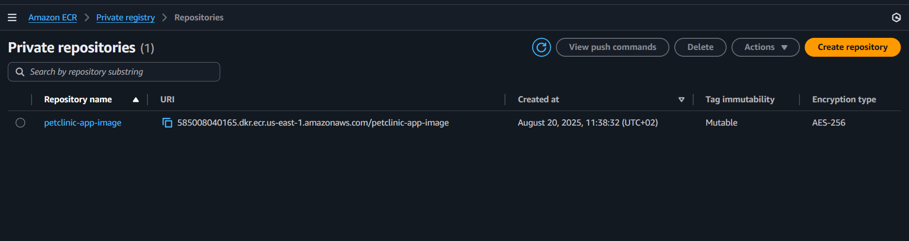
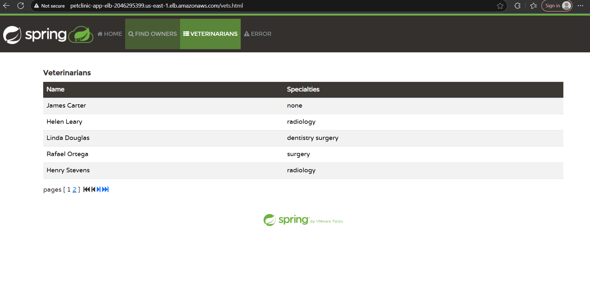
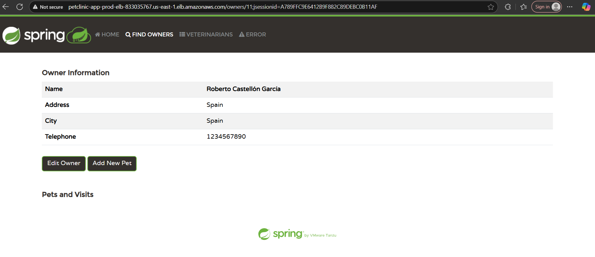
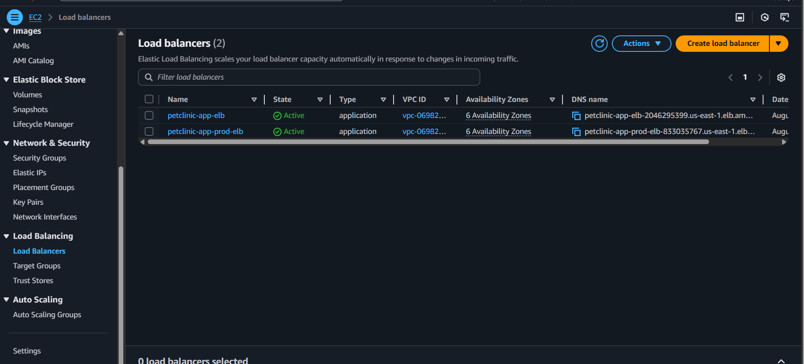
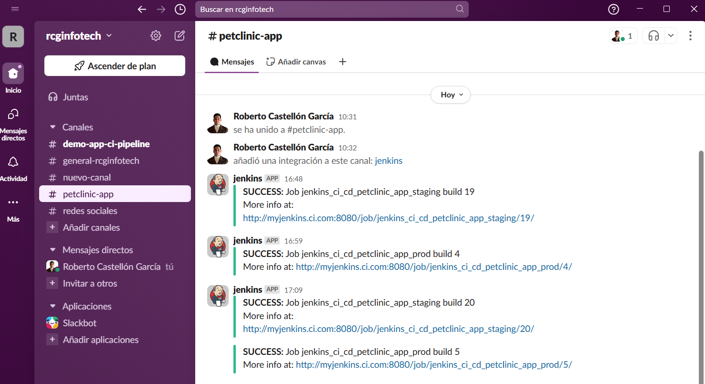
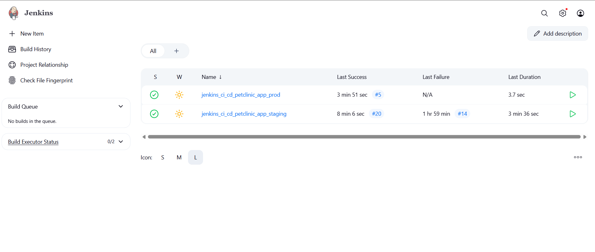
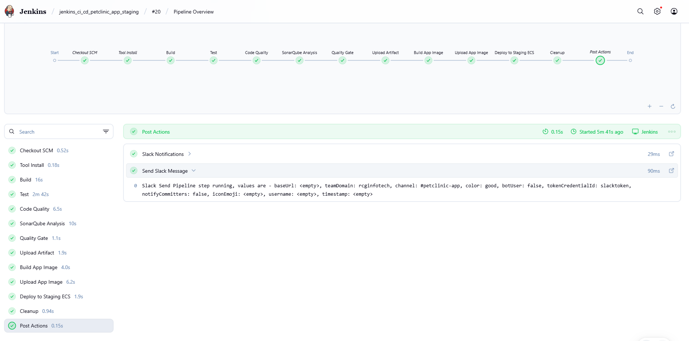
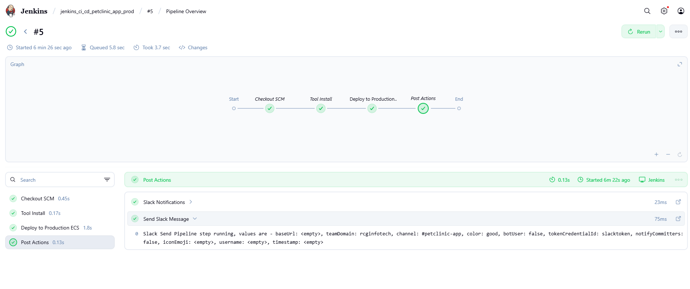

# CI/CD Pipeline for Spring Petclinic Application

## Overview
This project demonstrates a **complete CI/CD pipeline** for the [Spring Petclinic](https://github.com/spring-projects/spring-petclinic) application, a sample Java project.  
The goal was to take a real-world Java application from GitHub and implement a full end-to-end pipeline that covers build, testing, code quality checks, artifact management, containerization, and deployment to AWS ECS (both **staging** and **production**) using Jenkins.

---

## Pipeline Stages

### 1. Build
- Jenkins fetches the source code from GitHub.  
- Maven is used (via `settings.xml`) to compile the project and package it into a `.jar`.  
- The artifact is archived inside Jenkins for traceability.  

**Technologies:** Maven, JDK 21  
**Skills demonstrated:** Dependency management, build automation  

### 2. Test
- Unit and integration tests are executed with Maven.  
- The `verify` goal ensures that the project is in a consistent state.  

**Technologies:** JUnit, Maven  
**Screenshot:** 

### 3. Code Quality & Static Analysis
- **Checkstyle** is executed to enforce coding standards.  
- Results are exported to XML reports.  

**Technology:** Checkstyle

### 4. SonarQube Analysis
- The pipeline integrates with a SonarQube server (`sonarserver`).  
- `sonar-scanner` is used to upload source code, test results, coverage reports, and checkstyle results.  
- **Quality Gates** are enforced: if they fail, the pipeline aborts.  

**Screenshot:** 

### 5. Nexus Integration (Artifact Repository)
- A **Nexus 3 repository** is used as a proxy for Maven Central, caching dependencies.  
- The pipeline uploads the generated `.jar` to the Nexus `release` repository.  
- This ensures traceability and versioning of all artifacts.  

**Screenshot:** 

### 6. Build Docker Image
- The `.jar` downloaded from Nexus is copied into a build context (`docker_build/`).  
- Jenkins builds a Docker image using the `Dockerfiles/Dockerfile`.  
- The image is tagged with both the Jenkins build number and `latest`.  

**Technology:** Docker

### 7. Push Docker Image to Amazon ECR
- Jenkins authenticates with AWS ECR using stored credentials (`awscreds`).  
- The Docker image is pushed to **Amazon Elastic Container Registry (ECR)**.  

**Screenshot:** 

### 8. Deploy to Amazon ECS
- The pipeline updates the ECS service to force a new deployment with the latest container image.  
- Two separate ECS clusters are used:  
  - **Staging**: for testing deployments  
  - **Production**: for live application  

**Screenshots:**  
- Staging ECS Cluster →   
- Production ECS Cluster →   
- ECS Load Balancer → 

### 9. Cleanup
- To prevent Jenkins from accumulating unused images, the pipeline removes local Docker images after pushing them to ECR.  

**Command:** `docker rmi <image>:<tag>`

### 10. Slack Notifications
- At the end of every pipeline run, a Slack message is sent with the build status, job name, and link to Jenkins.  

**Screenshot:** 

## Separation of Pipelines

This project defines **two Jenkinsfiles** to handle different environments:

- `Jenkinsfile.staging` → Full CI/CD flow (build, test, quality checks, Nexus upload, Docker build, ECR push, ECS deployment in **staging**)  
- `Jenkinsfile.prod` → Lightweight pipeline triggered after merging to main, responsible for **production deployment only**  

**Screenshots:**  
- General Jenkins Pipelines →   
- Staging Pipeline →   
- Production Pipeline → 

---

## Tech Stack

- **CI/CD Orchestration**: Jenkins  
- **Build Tool**: Maven  
- **Language**: Java 21  
- **Artifact Repository**: Nexus 3  
- **Code Quality & Coverage**: SonarQube, Checkstyle, JUnit  
- **Containerization**: Docker  
- **Image Registry**: Amazon Elastic Container Registry (ECR)  
- **Deployment**: Amazon Elastic Container Service (ECS) with Load Balancer  
- **Notifications**: Slack  

---

## Why This Pipeline Matters

This project showcases the **end-to-end automation** of modern software delivery:  
- From **source code to production**, every step is automated.  
- Ensures **high code quality** with SonarQube gates.  
- Guarantees **artifact traceability** via Nexus.  
- Provides **reproducible deployments** with Docker and AWS ECS.  
- Uses **separation of concerns** (staging vs production Jenkinsfiles).  
- Demonstrates **real DevOps skills** with cloud-native infrastructure and CI/CD best practices.  

---

## Repository

📌 GitHub Repository: [jenkins_ci_cd_petclinic_app](https://github.com/Roberto-1998/jenkins_ci_cd_petclinic_app)

